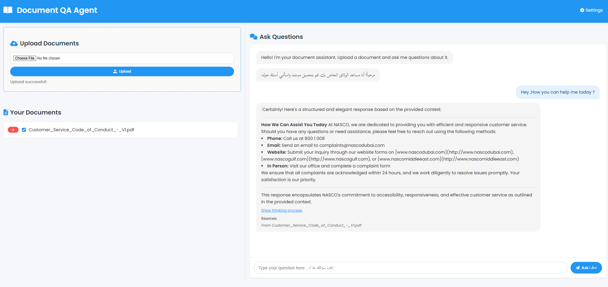
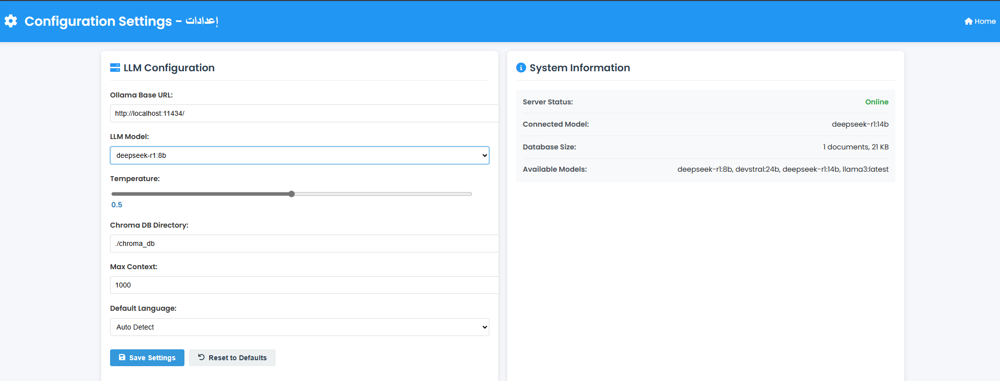

# Document QA Agent

This project is a document question-answering agent built with LangChain and Ollama. It allows you to upload documents and ask questions about their content.

## Features

- Upload PDF and TXT documents
- Ask questions about uploaded documents
- Get answers with source references
- Maintain conversation context
- Web UI for easy interaction
- Configurable LLM settings
- **Multi-language support including Arabic** (see [Arabic Support](docs/arabic_support.md))

## Screenshots

Here's a glimpse of the application:

**Home Page:**


**Settings Page:**


## Requirements

- Python 3.9 or later
- Ollama installed locally (https://ollama.com/)
- Other dependencies listed in `requirements.txt`

## Setup Instructions

1. **Install Ollama**
   - Download from [ollama.com](https://ollama.com/)
   - Install and run it locally

2. **Pull the required model**
   ```powershell
   ollama run deepseek-r1:8b
   ```
   This will download the model if you don't have it already.

3. **Install Python dependencies**
   ```powershell
   pip install -r requirements.txt
   ```

4. **Configure the application (optional)**
   Create a `.env` file in the root directory with the following variables:
   ```
   OLLAMA_BASE_URL=http://192.168.21.237:11434/
   OLLAMA_MODEL=deepseek-r1:8b
   TEMPERATURE=0.1
   CHROMA_PERSIST_DIR=./chroma_db
   MAX_CONTEXT=4
   ```

5. **Start the API server**
   ```powershell
   python run.py
   ```

6. **Access the web UI**
   Open your browser and navigate to http://localhost:8000

## API Endpoints

- `GET /` - Serves the web UI
- `GET /api` - Check if API is running
- `POST /api/upload` - Upload a document
- `GET /api/documents` - List all uploaded documents
- `POST /api/ask` - Ask a question about the documents

## Project Structure

```
app/
  ├── api/                # API endpoints
  │   ├── document_routes.py
  │   └── qa_routes.py
  ├── core/               # Core functionality
  │   ├── document_store.py
  │   └── llm.py
  ├── utils/              # Utility functions
  │   ├── config.py
  │   └── middleware.py
  └── main.py             # FastAPI application
chroma_db/                # Vector DB storage
requirements.txt          # Dependencies
run.py                    # Entry point
static/                   # Static files (HTML, CSS, JS)
  └── index.html
```

## How It Works

1. Documents are uploaded, processed, and stored in a ChromaDB vector database
2. When a question is asked, relevant document chunks are retrieved
3. The question and retrieved context are sent to the Ollama LLM
4. The LLM generates an answer based on the provided context
5. The answer and source references are returned to the user

## Customization

- Change the LLM model by setting the `OLLAMA_MODEL` environment variable
- Adjust retrieval parameters by modifying the `MAX_CONTEXT` environment variable
- Customize the UI by modifying the files in the `static` directory

## Contributing

Contributions are welcome! Please feel free to submit a Pull Request.

## License

This project is licensed under the MIT License - see the LICENSE file for details.
